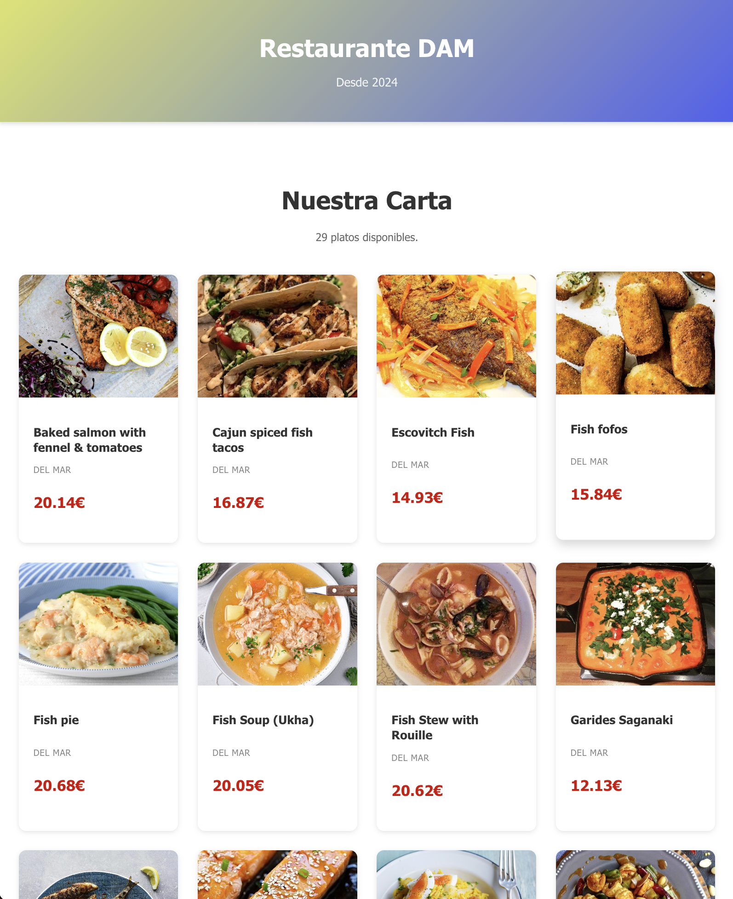
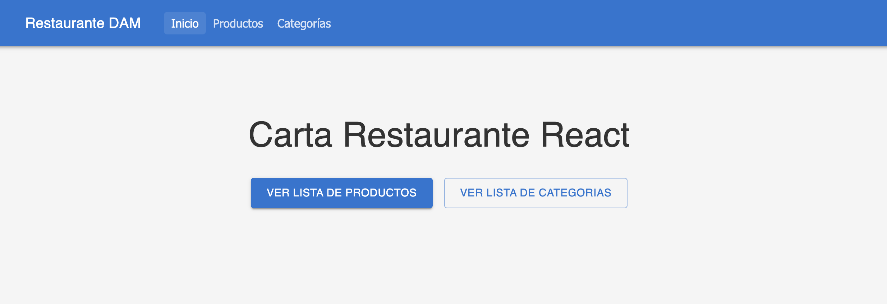
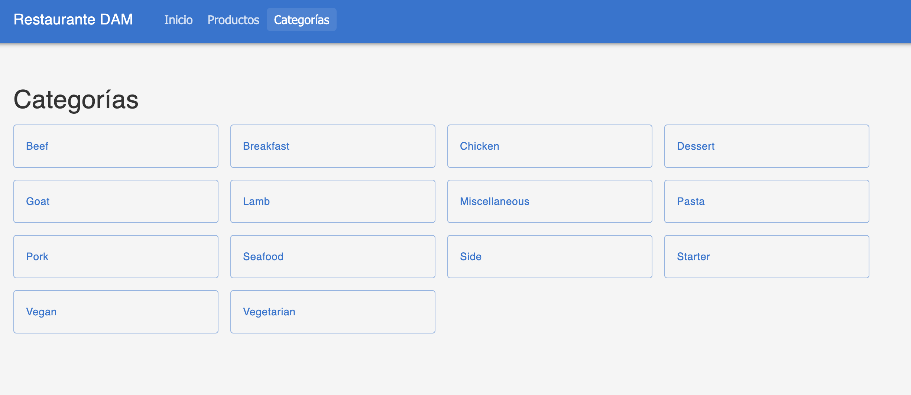
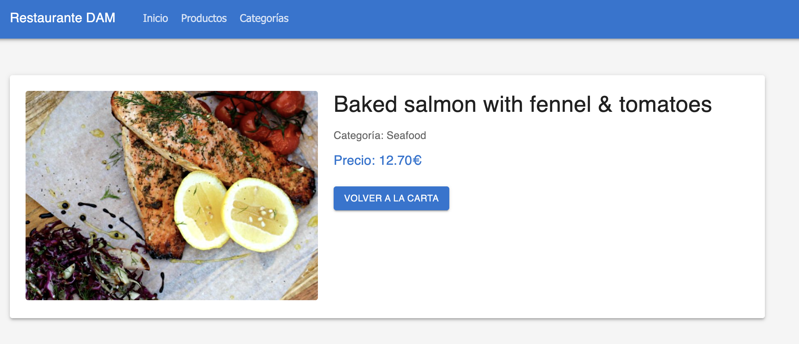

# Carta Restaurante



- [API](#api)
- [Componentes Empleados](#componentes-empleados)
    - [MenuItem](#menuitem)
    - [MenuList](#menulist)
- [App.jsx](#appjsx)
- [Empleo de Rutas](#empleo-de-rutas)
    - [App.jsx 2.0](#appjsx-20)
    - [api.js](#apijs)
    - [Home.jsx](#homejsx)
    - [Header.jsx](#headerjsx)
    - [Menu.jsx](menujsx)
    - [Categorias.jsx](#categoriasjsx)
    - [Producto.jsx](#productojsx)
- [Repositorio](#repositorio)


Proyecto sobre una carta de restaurante mediante conexión via API.

## API
La conexción con la API facilitada en el enunciado se hace mediante el fichero **`api.js`**. 

## Componentes empleados
En el proyecto se un total de 2 componentes *(padre e hijo)* que se emplearán en **`App.jsx`**.

### MenuItem
En este componente representa cada **'tarjeta'** de la carta correpondiente a cada plato. Simplemente se definen la imagen, descripción, categoría (por lo pronto única) y precio.

Este sería el componente **'hijo'** ya que será empleado en otro componente fuera de **`App.jsx`**

### MenuList
En este componente vamos a iterar sobre cada producto que se encuentra en la API. Se compone de una cabecera y de un contador que 'mide' la longitud del json.

Seguidamente recorremos ese json con un **'map'** y dentro de este se empleará el componente **'hijo'** (por lo que el componente de esta sección es el **'padre'**). El resultado sería una **'tarjeta'** con cada elemento recibido de la API. 

## App.jsx
Este es el fichero principal de la aplicación.

En el llamamos a la API mediante useEffect. Con un **'map'** se define el nombre de cada variable para las claves del json. A continuación se configura el error y el spinner de carga.

Una vez definida esta estructura se procede a construir el html clásico en dónde llamamos a las funciones de error/éxito y al componente **padre** anterior. 

## Empleo de Rutas
En este apartado vamos a tratar el uso de *rutas anidadas* para navegar por la web.

En primer lugar, se plantea de la siguiente manera:
- Mantener componentes reutilizables del anterior ejercicio además de un Header para el NavBar
- Páginas: se va a trabajar con 4 páginas:
    - App: página *intro*
    - Home: Página Principal
    - Menu: Se listarán todos los productos
    - Producto: Cada producto por separado
    - Categorías: Se listarán todas las categorías

### App.jsx 2.0
En esta nueva versión de App.jsx se ha simplificado en gran medida el código respecto al anterior proyecto. En este caso vamos a emplearlo solamente para llamar a las rutas de las otras páginas. También se crea una función para contemplar la posibilidad de que un usuario se pase de listo y accesa a una ruta inválida.

Se realizarán las siguientes importaciones para el manejo de rutas:
```javascript
import { Routes, Route } from 'react-router-dom';
```
Y se aplicarán de la siguiente manera -> encapsulando cada ruta en un solo componente **Routes**:
```javascript
<Routes>
    <Route path='/' element={<Home />} />
    <Route path='/categorias' element={<Categorias />} /> // se utilizan los atributos path para definir la ruta y element para llamar a la Página
    // ...Resto de código...
</Routes>
```



### api.js
Se va a emplear este fichero para agrupar todos los metodos GET para leer la información de la api, en lugar de tenerlo en cada componente. También se empleará para alojar la función que establece precios aleatorios con *Math.random*

Se emplearán tres funciones donde se leeran:
- Categorías -> fetchCategorias
- Todos los productos -> fetchProductosCategoria
- Productos individualmente -> fetchProductoId

Pero antes que nada se declara la variable URL donde irá la API

A continuación un breve resumen de como funcionan las funciones. Primero, y por su similitud, vamos con *fetchCategorias* y *fetchProductosCategoria*:
- En ambas funciones realizaremos un fetch para llamar a la API aplicando un manejo de errores. Pero en ambas, como vamos a tener que recorrer el JSON que devuelve la api, aplicaremos un *map* para recorrer dicha 'lista' y que retorne las categorías y los productos (en este último nos devolverá toda la información del producto)

En *fetchProductoId* se aplica la misma lógica hasta el *return*, donde ahora solo devuelve el producto por el id.

A continuación una breve explicación de la llamada a la API desde el código:
```javascript
const endpoint = `${URL}/filter.php?c=${encodeURIComponent(category)}`; // se define el endpoint (o 'ruta') de la api
const res = await fetch(endpoint); // llamamos a la 'ruta' definida anteriormente
if(!res.ok) throw new Error("error al cargar los productos"); // manejo de errores
const data = await res.json(); // Se obtiene el json con la información de la llamada
```

### Home.jsx
Nos despedimos de las etiquetas convencionales HTML para adoptar las etiquetas propias de Material UI. Por ello, en este componente como en los siguientes, se aplicarán varias importaciones de la siguiente manera:
```javascript
import Box from '@mui/material/Box';
import Button from '@mui/material/Button';
import Container from '@mui/material/Container';
import Typography from '@mui/material/Typography';
import Stack from '@mui/material/Stack';
```
Se puede observar que se importa cada etiqueta que se vaya a emplear.

Este componente será la página principal de la app. En él se en contrarán simplemente un título y dos botónes para acceder a todos los productos y a todas las categorías:
```javascript
<Button variant="contained" size="large" component={RouterLink} to="/menu"> // Ruta hacia la lista de productos
    Ver Lista de Productos
</Button>
<Button variant='outlined' size='large' component={RouterLink} to='/categorias'> // Ruta hacia la lista de Categorías
    Ver lista de Categorias
</Button>
```

### Header.jsx
En este componente se construirá un encabezado para dejarlo presente en todo momento en la app. Primero se define una función *flecha* en la que se van a definir las propiedades de los botones del header para cuando estén pulsados o no, indicando así en que página se está en cada momento.

El siguiente paso será definir la función principal del componente donde irán el resto de propiedades, como definir la barra superior y los botones con las rutas a las páginas correspondientes

### Menu.jsx


Esta página será donde se listarán todos los productos de la URL de la API.

En primer lugar se definen las *'variables'* manejar los productos, la carga y los errores con **useState**.

A continuación, mediante *useEffect*, se realiza la carga de productos con 'seaFood' como categoría por defecto. Se implementa un sistema de limpieza con la variable *montado* para evitar actualizaciones de estado:
```javascript
const cat = idCategoria ? decodeURIComponent(idCategoria) : "Seafood"; // si existe categoría se usa, si no, se usa 'SeaFood'
let montado = true;

async function cargarProductos(){
    try{
        setCargando(true);
        setError(null);
        const datos = await fetchProductosCategoria(cat); // Si no da error, se cargan las productos
        if(montado) setProductos(datos);
    } catch(error){
        if(montado){
            setError("Error al cargar los productos"); // manejo de errores
            setProductos(null);
        }
    } finally {
        if(montado) setCargando(false);
    }
}
```

Finalmente, el componente renderiza condicionalmente tres posibles estados:
- Cargando: Muestra un spinner de carga mientras se obtienen los productos
- Error: Muestra un mensaje de error si algo falla
- Éxito: Renderiza el componente *MenuList*, que ya se usó en la práctica anterior, pasándole los productos obtenidos

### Categorias.jsx

Esta página mostrará todas las categorías disponibles y donde podremos acceder a los productos pertenecientes a ella. Se definen los estados necesarios igual que en Menu.jsx (categorías, cargando y error). De manera similar al apartado anterior, en el *useEffect* se llama a la función *fetchCategorias()* para obtener todas las categorías disponibles de la API:

El componente renderiza con botones para cada categoría. Cada botón está configurado como enlace usando *RouterLink* y navega a la ruta de las categorías:
```javascript
<Button
    fullWidth
    variant='outlined'
    component={RouterLink}
    to={`/categorias/${encodeURIComponent(cat)}`}
    sx={{ textTransform: "none", justifyContent: 'flex-start', p:2}}>
    {cat}
</Button>
```

### Producto.jsx


Esta página muestra el detalle completo de cada producto seleccionado. Se obtiene el *id* del producto desde los parámetros de la URL mediante *useParams()*. Antes de hacer la petición, se valida que el id exista:
```javascript
const { id } = useParams();

if(!id){
    setError("ID no válido");
    setCargando(false);
    return;
}
```

Se realiza la carga del producto mediante la función *fetchProductoId(id)* siguiendo el mismo patrón que en los componentes anteriores.

## Repositorio 
https://github.com/MynameisJoni/menu-restaurante-javascript

**Tener en cuenta que se usa el mismo repositorio para las dos prácticas. Revisar el commit anterior para la primera entrega ya que el commit actual es con la segunda entrega*